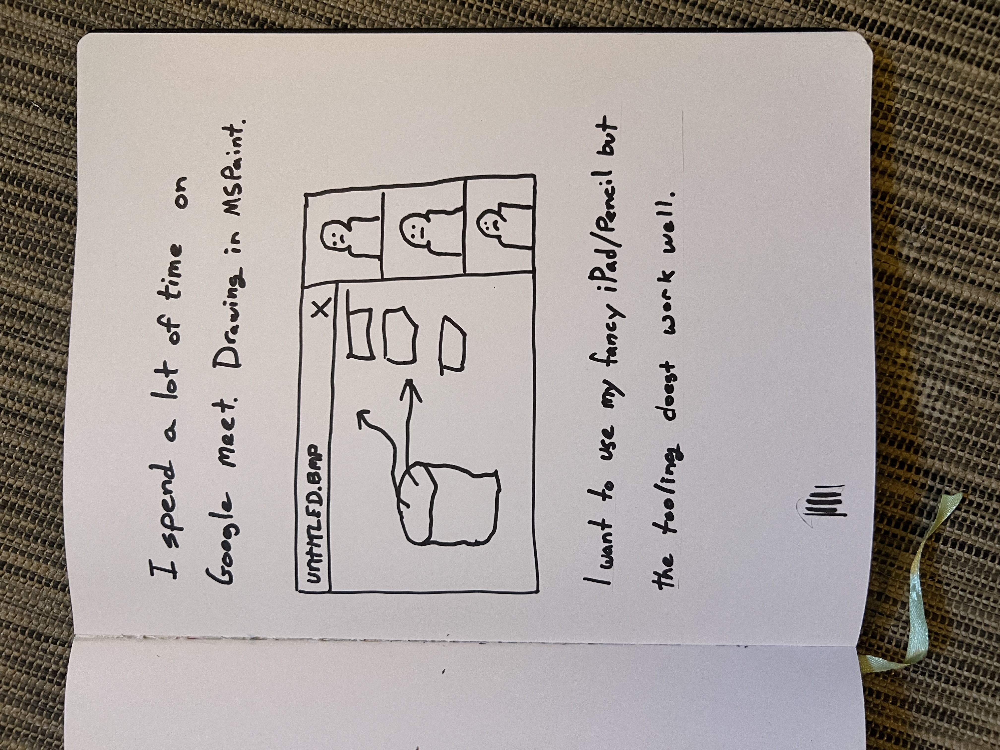
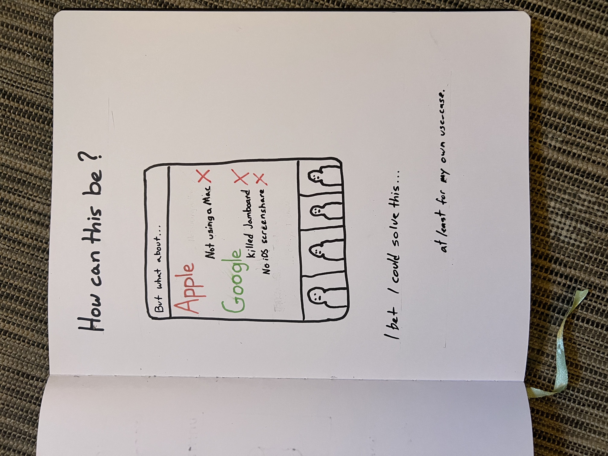
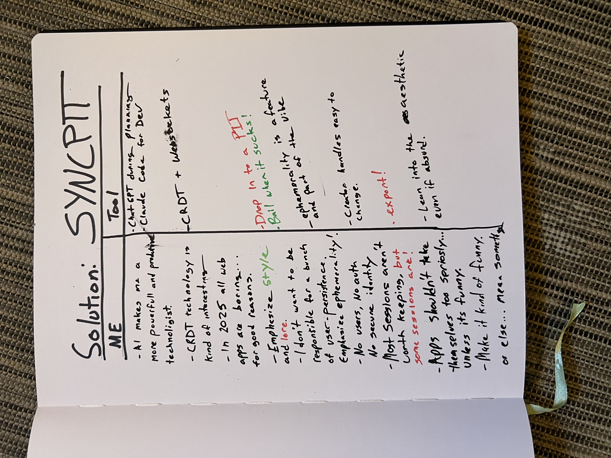

# Why Sync Pit Exists

## The Problem

I spend all day on Google Meet, frequently making system drawings in MSPaint. But I have an iPad mini with an Apple Pencil. The hardware is beautiful and the pen feels lovely to use. I should be able to use it for my meetings!

## _How can this be?_

### Apple?

It would be great if I could screenshare my iPad to my desktop PC, but you can only screen share to a Mac.

### Google?

Google had an answer to this problem called Jamboard. It's been abandoned, and the Google Meet experience on iOS doesn't permit screensharing.

## The Solution

**Sync Pit.**

I made Sync Pit to solve this problem. I gave it a punk rock motif because otherwise it would be as boring as this explanation modal.

_Now I can draw on my iPad while sharing my browser window in meetings. Problem solved._
